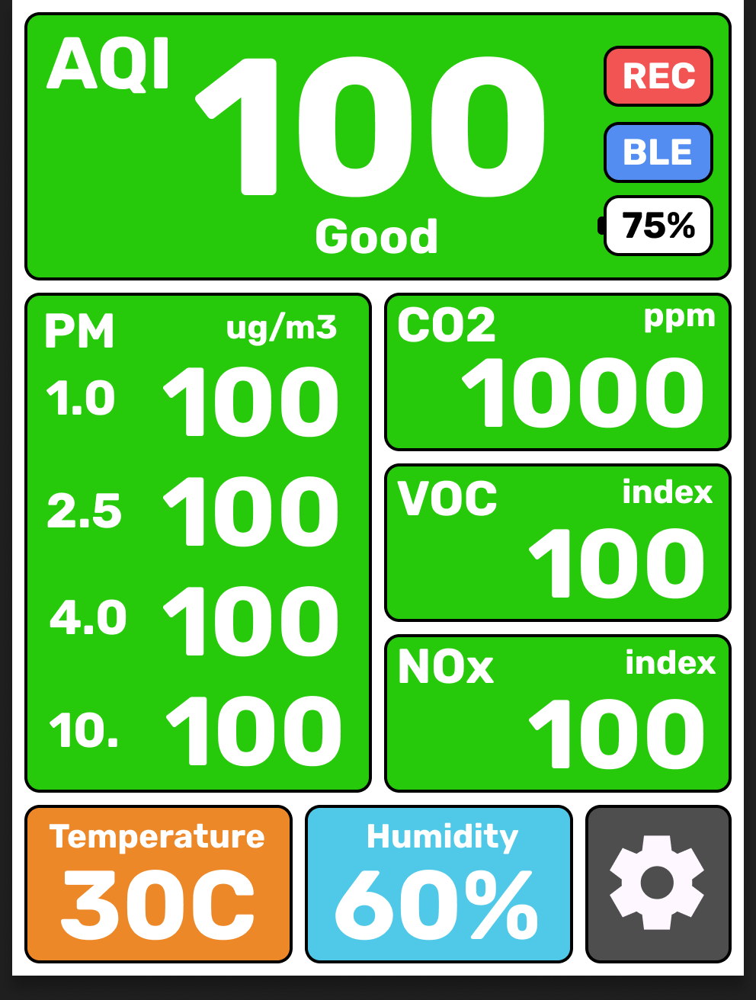

# Portable AQI Recorder



A compact, battery-friendly Air Quality Index monitor built with an **ESP32-C3 Super Mini** and a **Sensirion SEN5x** environmental sensor. The firmware **auto-detects** which sensor variant is connected — **SEN50**, **SEN54**, or **SEN55** — and adapts accordingly. View and record real-time readings in the included Web Bluetooth app.

## Features

- **Real-time PM monitoring** — PM1.0, PM2.5, PM4.0, PM10.0 (µg/m³)
- **Environmental data** (SEN54/SEN55) — Humidity, Temperature, VOC Index
- **NOx monitoring** (SEN55) — NOx Index
- **US EPA AQI calculation** — computed from PM2.5 & PM10, printed to serial
- **BLE streaming** — connect with the included Web Bluetooth recorder app
- **Auto-detection** — firmware identifies SEN50/SEN54/SEN55 at boot, no code changes needed
- **Data logging** — record, chart, and export CSV data from the web app
- **Tiny form factor** — ESP32-C3 Super Mini is just 22×18 mm

### Sensor Comparison

| Measurement | SEN50 | SEN54 | SEN55 |
|---|:---:|:---:|:---:|
| PM1.0 / PM2.5 / PM4.0 / PM10.0 | ✅ | ✅ | ✅ |
| Humidity (RH%) | — | ✅ | ✅ |
| Temperature (°C) | — | ✅ | ✅ |
| VOC Index | — | ✅ | ✅ |
| NOx Index | — | — | ✅ |

---

## Hardware

| Component | Description |
|---|---|
| **ESP32-C3 Super Mini** | Microcontroller with BLE & Wi-Fi |
| **Sensirion SEN50 / SEN54 / SEN55** | Environmental sensor module (auto-detected) |
| **ST7789 2.4" TFT Display** | SPI display for real-time visualization |
| **4x Push Buttons** | Navigation controls (Up, Down, Select, Record) |

### Wiring

#### SEN5x Environmental Sensor

All three SEN5x variants use the **same pinout and connector** — just swap the sensor module.

| ESP32-C3 Super Mini | SEN5x (JST connector) |
|---|---|
| GPIO 8 (SDA) | Pin 3 — SDA |
| GPIO 9 (SCL) | Pin 4 — SCL |
| GND | Pin 2 — GND |
| 5V | Pin 1 — VDD |

> [!IMPORTANT]
> The SEN5x sensors **require 5V** for the internal fan. Power from a 5V source (e.g. USB VBUS), not the ESP32's 3.3V output. The I2C lines are 3.3V tolerant — no level shifter needed.

#### SEN5x Connector Pinout

Pin numbers below follow Sensirion's connector drawing; do not infer numbering from a cable's viewing direction or wire colors. See the [SEN5x datasheet, Table 11](https://sensirion.com/resource/datasheet/sen5x).

```text
Pin 1 — VDD  (5V)
Pin 2 — GND
Pin 3 — SDA
Pin 4 — SCL
Pin 5 — SEL (tie to GND before or at power-up for I2C)
Pin 6 — NC
```

These are SEN5x connections. SEN6x requires a 3.3V supply and has different functions on pins 5 and 6; it must not be plugged into this 5V connection. The custom PCB architecture is tracked in [hardware/rev-a/design-brief.md](hardware/rev-a/design-brief.md).

#### ST7789 2.4" SPI TFT Display (10-Pin Version)

| ESP32-C3 Super Mini | ST7789 Display Pin |
|---|---|
| GND | 1 — GND |
| GPIO 0 | 2 — DC / RS |
| GPIO 7 | 3 — CS |
| GPIO 4 | 4 — SCL |
| GPIO 6 | 5 — SDA / MOSI |
| GPIO 1 | 6 — RST |
| 3.3V | 7 — VCC |
| GND | 8 — GND |
| 3.3V | 9 — Anode (A) |
| GND | 10 — Cathode (K) |

#### Navigation Buttons

Wire each push button between the specified ESP32-C3 GPIO pin and **GND**. The firmware uses internal pull-up resistors.

| ESP32-C3 Super Mini | Button Function |
|---|---|
| GPIO 20 | Up |
| GPIO 21 | Down |
| GPIO 5 | Select |
| GPIO 3 | Record |

---

## Software Setup

### Prerequisites

1. **PlatformIO** — Install the [PlatformIO IDE extension](https://platformio.org/install/ide?install=vscode) in VS Code, or install the [PlatformIO CLI](https://docs.platformio.org/en/latest/core/installation.html).

2. **Chrome or Edge** — Web Bluetooth is required for the browser recorder.
   > [!WARNING]
   > If you are using **Brave Browser**, Web Bluetooth is disabled by default for privacy reasons. To use the app in Brave, you must enable "Web Bluetooth" in `brave://settings/privacy`.

### Build & Upload

1. **Clone the repository**
   ```bash
   git clone https://github.com/devalopr/Portable-AQI-recorder-.git
   cd Portable-AQI-recorder
   ```

2. **Build the firmware**
   ```bash
   pio run
   ```
   > If `pio` isn't in your PATH, use the full path:
   > `C:\Users\<YOU>\.platformio\penv\Scripts\pio.exe run`

3. **Upload to ESP32-C3**
   
   Connect the ESP32-C3 Super Mini via USB-C, then:
   ```bash
   pio run -t upload
   ```

4. **Monitor serial output** (optional)
   ```bash
   pio device monitor
   ```

   **SEN50 output:**
   ```
   Detected: SEN50 (PM only)
   PM1.0: 5.20   PM2.5: 8.10   PM4.0: 9.30   PM10.0: 10.50   | AQI(PM2.5): 34  AQI(PM10): 10  => AQI: 34 [Good]
   ```

   **SEN55 output:**
   ```
   Detected: SEN55 (PM + T/RH + VOC + NOx)
   PM1.0: 5.20   PM2.5: 8.10   PM4.0: 9.30   PM10.0: 10.50   RH: 45.2%   T: 24.3°C   VOC: 102   NOx: 5   | AQI(PM2.5): 34  AQI(PM10): 10  => AQI: 34 [Good]
   ```

---

## Web BLE Recorder

This repository includes a browser app in `web/` for live viewing and recording from the AQI recorder over BLE. The ESP32 advertises as `AQI Recorder`.

### Features

- Live cards for AQI, PM1.0, PM2.5, PM4.0, PM10, humidity, temperature, VOC, and NOx
- Light and dark mode
- Local recording in the browser while connected
- Multi-series charting for any available field over time
- Recent sample table and CSV export

### Run Locally

Web Bluetooth requires a secure browser context. `localhost` is treated as secure by Chromium-based browsers.

Double-click `AQI Recorder.app` in this project folder, or run:

```bash
python3 -m http.server 8080 --directory web
```

Then open [http://localhost:8080](http://localhost:8080) in Chrome or Edge, click **Connect**, and choose `AQI Recorder`.
*(Note: If using Brave, ensure Web Bluetooth is enabled in `brave://settings/privacy`!)*

The firmware exposes this Web Bluetooth service:

| Item | UUID |
|---|---|
| Web AQI Service | `7b46a200-fd8a-4a28-8f4b-4b3e7c4f0001` |
| Live Sample Characteristic | `7b46a201-fd8a-4a28-8f4b-4b3e7c4f0001` |
| Status Characteristic | `7b46a202-fd8a-4a28-8f4b-4b3e7c4f0001` |

---

## AQI Reference

The firmware calculates the **US EPA Air Quality Index** from PM2.5 and PM10. The overall AQI is the higher of the two sub-indices.

| AQI Range | Category | Color |
|---|---|---|
| 0 – 50 | Good | 🟢 Green |
| 51 – 100 | Moderate | 🟡 Yellow |
| 101 – 150 | Unhealthy for Sensitive Groups | 🟠 Orange |
| 151 – 200 | Unhealthy | 🔴 Red |
| 201 – 300 | Very Unhealthy | 🟣 Purple |
| 301 – 500 | Hazardous | 🟤 Maroon |

---

## Project Structure

```
Portable-AQI-recorder-/
├── assets/               # UI mockups and images
├── scripts/              # Python testing/utility scripts
├── tools/                # Font generation tools
├── src/                  # Main C++ firmware (sensor + BLE + AQI)
├── AQI Recorder.app      # Double-click launcher for the web app
├── web/                  # Web Bluetooth recorder app
├── platformio.ini        # PlatformIO configuration
└── README.md             # This file
```

## Dependencies

All dependencies are managed automatically by PlatformIO:

| Library | Version | Purpose |
|---|---|---|
| Sensirion I2C SEN5X | ^0.3.0 | I2C driver for SEN50/SEN54/SEN55 sensors |
| NimBLE-Arduino | ^1.4.1 | Lightweight BLE stack for ESP32 |

---

## Troubleshooting

| Problem | Solution |
|---|---|
| `pio` not found | Use full path `~/.platformio/penv/Scripts/pio.exe` or add it to PATH |
| Serial shows no output | Wait 2–3 seconds after reset; check baud rate is **115200** |
| All PM values are 0.00 | SEN5x fan needs ~10 seconds warm-up after startup |
| BLE device not visible | Re-check wiring; ensure SEN5x has 5V power |
| Web app cannot pair in Brave | Brave disables Web Bluetooth by default. Enable it via `brave://settings/privacy` |
| Upload fails | Hold BOOT button on ESP32-C3, click upload, release BOOT after "Connecting..." |
| VOC/NOx shows "n/a" | Normal for the first ~10 seconds after boot; wait for sensor warm-up |
| Wrong sensor detected | Check I2C wiring; try power-cycling the sensor |

---

## License

MIT License — see [LICENSE](LICENSE) for details.
