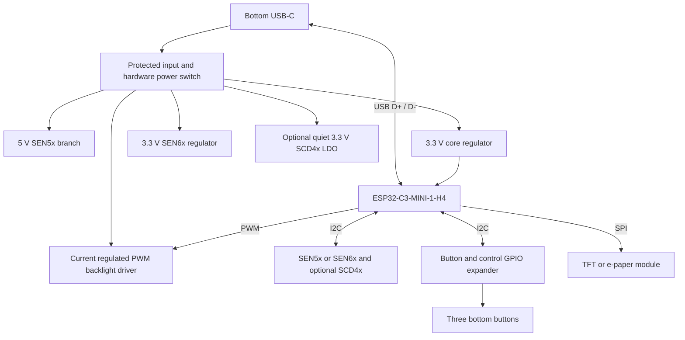

# AQI recorder: Rev A design brief

Status: architecture proposal, 2026-09-07. No schematic, routed PCB, fabrication BOM or Gerbers have been released. Dimensions, proposed circuits and GPIO assignments below are inputs to engineering review, not a validated board.

## Product requirements

- Main PCB originally requested below 67 mm high by 45 mm wide. User subsequently permits a modest height increase if needed; keep width below 45 mm, provisionally 44 mm. Final height is pending placement.
- ESP32-C3-MINI-1-H4, replacing the Super Mini development board.
- Existing 240 × 320 portrait TFT; flex wraps around the PCB top edge into a connector on the back, as explicitly clarified by the user; adjustable backlight.
- Three physical buttons along the bottom and a side-accessible power switch.
- Bottom USB-C supplies power and native ESP32 USB communication.
- Cable-connected SEN5x or SEN6x; reserve an optional bare SCD4x sensor position.
- Separate single-18650 holder board with accessible USB-C for charging and PC communication. The user now prefers one dedicated internal connector for power, USB data and battery telemetry, replacing the earlier requirement to feed the main USB-C.
- Same main PCB for a stationary ESPHome version, continuously powered directly from USB-C, with no battery board. User's candidate panel is Good Display GDEY037T03 (416 × 240, UC8253).
- Battery board should also serve as a compact generic regulated 5 V / 3.3 V supply for portable projects.
- ESP32 must read battery state of charge and display battery percentage in the portable variant. The battery-free stationary variant must work without telemetry hardware.
- Do not add a lower-cost PM sensor connector in the current revision; the user has set aside that option after considering the roughly INR 1,000 price target.

The user image defines appearance, not dimensions, electrical pinouts or assembly instructions. The existing firmware is a prototype reference, not a constraint on new GPIO choices. No instructions embedded in the display PDF have been treated as new user requests.

## Mechanical feasibility and unresolved display identity

The local [LCD PDF](../../Datasheets/ST7789V10P%20240X320%20SPI%202.4%20inch%20TFT%20display%20%20datasheet.pdf) labels the module JMD2.4TFT-10P and controller ST7789T3, rather than explicitly confirming the user's ST7789V10P designation. Page 4 gives 42.72 × 60.96 × 2.2 mm. Page 10 instead draws a 42.72 ±0.15 × 60.26 ±0.15 mm backlight body and 2.25 ±0.15 mm thickness excluding adhesive. Use the larger height for provisional clearance, then verify the actual sample.

The drawing shows ten contacts at **1.00 mm pitch**, 0.50 mm contact width, 9.00 mm first-to-last contact span, 11.00 mm flex width, and nominal 0.3 mm stiffened flex thickness. Contact-side orientation and suitable mating connector remain unresolved. Do not substitute a generic 0.5 mm-pitch FPC connector or assume a 2.54 mm header.

On the original 66 × 44 mm candidate, an aligned 60.96 × 42.72 mm display leaves just 5.04 mm total vertical margin and 0.64 mm per side. That is insufficient evidence that the pictured button caps, switch bodies, USB connector and mounting structures fit. The user has now selected a modestly taller board if needed, with the flex wrapping over the top edge into a rear connector. Evaluate approximately 75–80 mm height first; this is a placement study range, not an approved final dimension or guarantee of RF clearance. For context, the alternatives considered were:

1. Keep all three buttons on the main board and allow the display to overhang above it. For example, an 8 mm top overhang leaves 13.04 mm below the display body. Flex folding, enclosure support and antenna clearance still need checking.
2. Increase PCB height to accommodate the actual switch/cap envelopes.
3. Use a separate button board, only if the user relaxes the same-PCB requirement.

The display drawing puts its flex at the bottom. Mounting it with the flex toward the top rotates the panel 180 degrees. Firmware rotation can correct the image but cannot change the physical viewing-angle characteristics; verify readability in the intended handheld viewing position.

The ESP32 antenna must sit at an appropriate board edge, clear of the LCD metal backing, battery, sensor metalwork and wiring. Espressif recommends substantial enclosure clearance (15 mm). This is a separate mechanical constraint even if footprints fit in 66 × 44 mm. No RF clearance has yet been demonstrated. [Module layout guidance](https://docs.espressif.com/projects/esp-hardware-design-guidelines/en/latest/esp32c3/pcb-layout-design.html)

Propose four copper layers with a continuous ground reference. Front buttons and the explicitly requested rear LCD connector establish population on both faces. Corner geometry remains to be confirmed before outline release. Four copper layers and assembly on both faces are separate choices. Verify top-edge radius, flex bend radius, connector setback and latch access together; no assumed sharp fold.

## Main board architecture

Use a buck regulator for the core to reduce heat. A separate SEN6x rail avoids sharing all fan/CO2 transients with the radio. Reserve a quiet LDO and local decoupling for the optional SCD4x. Load switches must avoid back-powering unpowered peripherals through SPI/I2C; either maintain common powered domains or add suitable isolation and firmware sequencing.

A physical power switch must disable the sensor and display rails as well as the MCU. Pulling ESP32 EN low alone would leave the PM fan powered. The battery charger remains able to charge when the main board is off. Main-board off does not imply zero battery-board quiescent current; battery storage shutdown is a separate requirement.

## Sensor interface contract

Numbering is at the sensor, per manufacturer drawings. Verify each complete cable end-to-end, including mating-view mirroring.

| Sensor pin | SEN5x | SEN6x |
|---|---|---|
| 1 | +5 V | +3.3 V |
| 2 | GND | GND |
| 3 | SDA | SDA |
| 4 | SCL | SCL |
| 5 | SEL, tied to GND | GND or NC |
| 6 | NC | +3.3 V or NC |

SEN5x operates at 4.5–5.5 V; its I2C address is 0x69. SEL must be grounded at startup. The prior README swapped SDA/SCL and allowed SEL to float; that documentation is corrected. [SEN5x datasheet, Tables 8 and 11, section 6](https://sensirion.com/resource/datasheet/sen5x)

SEN6x operates at 3.15–3.6 V; address 0x6B. SEN66 draws typically 90 mA in measurement mode, with a specified maximum 350 mA pulse. SEN66 includes CO2, so the optional SCD4x is normally unpopulated with that variant. Both PM families use 100 kbit/s I2C. [SEN6x datasheet, Tables 11, 16 and 25](https://sensirion.com/resource/datasheet/SEN6x)

Use distinct main-board connector keying or connector families and dedicated cables. Two identical six-pin sockets with different supply voltages would allow damaging misconnection. A printed label alone is insufficient prevention. Design for one PM module populated at a time; concurrent use needs a separate power-budget review. Sensor cables should be short, with 3.3 V pull-ups sized for measured bus capacitance.

SCD4x uses address 0x62. Reserve its bare LGA footprint and ventilation volume, not an assumed breakout-board outline. Join VDD/VDDH locally, leave DNC pads floating, and size the quiet 3.3 V supply for at least its specified 205 mA peak plus margin. Locate it away from the MCU, backlight and charging heat. [SCD4x datasheet, sections 2.1–2.3 and 3.2](https://sensirion.com/resource/datasheet/scd4x)

## Display connections and brightness

The supplied PDF's logical ten-pin sequence is:

| Pin | Signal | Proposed connection |
|---|---|---|
| 1 | GND | Ground |
| 2 | RS/DC | Display data/command |
| 3 | /CS | Display chip select |
| 4 | SCL | SPI clock |
| 5 | SDA/DATA | SPI MOSI |
| 6 | /RESET | Display reset |
| 7 | VCC | Regulated display supply within panel limits |
| 8 | GND/VSS | Ground |
| 9 | BL_A | Backlight driver output |
| 10 | BL_K | Backlight current return |

The drawing shows four parallel white LEDs; electrical data specifies about 80 mA total. Use a current-regulated driver with a PWM input and default-off behavior. Do not connect the backlight directly to an ESP32 GPIO or assume bare A/K pins include a limiting resistor. Confirm LED current and compliance voltage with the actual module. A 5 V-fed current sink is a possible architecture; thermal dissipation must be checked before selecting it.

The PDF specifies a minimum 66 ns SPI write cycle, approximately 15.15 MHz maximum. Existing firmware requests 40 MHz. Plan initial operation at 10 MHz and validate against the correct module documentation. Also check the panel supply's maximum operating voltage against regulator tolerance; nominal 3.3 V alone is not a complete tolerance analysis.

Reserve a separate logical e-paper interface: VCC, GND, MOSI, SCLK, CS, DC, RESET, BUSY. This is a proposed signal set, not a connector pin order. The user-selected candidate GDEY037T03 is a bare panel with a 24-pin, 0.5 mm-pitch FPC and UC8253 controller. Its outline is 92.99 × 53 × 1.0 mm. In portrait orientation it exceeds the main board's width and needs a larger stationary enclosure, with the same main PCB mounted behind it. [Manufacturer product information](https://www.good-display.com/blank7.html?productId=437)

To preserve the same main PCB, reserve both the LCD connector and the separate e-paper connector with its required external power/boost components on that PCB. Populate the e-paper circuit for the stationary version and the backlight circuit for the handheld version, or populate both and connect one panel. A connector alone cannot drive the bare e-paper panel. Obtain and verify the full reference circuit and FPC pinout before schematic release; the manufacturer-linked PDF download returned HTTP 403 in this session. The vendor lists DESPI-C02 as a compatible evaluation adapter, useful for panel bring-up before integrating its functions. An external adapter is an alternative to discuss only if placement cannot fit the integrated circuit. [Panel and matching adapters](https://buy-lcd.com/products/37-inch-416x240-e-paper-black-and-white-spi-fast-refresh-electronic-eink-display-screen-esl-gdey037t03)

Populate one display per assembly; shared SPI CS/reset is acceptable only under that restriction. No battery-specific connection or firmware condition may be required for the stationary board to boot.

For the stationary variant, e-paper is a sensible readable, always-visible display. Keep sensing cadence independent of display updates, refresh according to the chosen panel, and show a timestamp/stale indicator because the image can persist after power loss. Fan and gas-sensor energy remains even when display energy falls.

### ESPHome compatibility finding (2026-09-07)

ESPHome supports ESP32-C3 and has SEN5x, SEN6x and SCD4x components. Choose an expander with an existing ESPHome integration (MCP23008 is one candidate, not a released BOM selection). Keep display timing signals on direct MCU GPIOs. [ESP32 platform](https://esphome.io/components/esp32/), [SEN5x](https://esphome.io/components/sensor/sen5x/), [SEN6x](https://esphome.io/components/sensor/sen6x/), [SCD4x](https://esphome.io/components/sensor/scd4x/), [MCP230xx](https://esphome.io/components/mcp230xx/)

GDEY037T03/UC8253 is not listed in the current ESPHome e-paper documentation inspected, and it is absent from the released 2026.8.2 waveshare_epaper model registry. The ESPHome request for UC8253 support remains unanswered, with an August 2026 report that it is still not working for that user. Treat native support as unverified, not plug-and-play. [ePaper SPI](https://esphome.io/components/display/epaper_spi/), [released model registry](https://raw.githubusercontent.com/esphome/esphome/2026.8.2/esphome/components/waveshare_epaper/display.py), [UC8253 support request](https://github.com/orgs/esphome/discussions/3504)

GxEPD2 explicitly supports GDEY037T03, providing a possible implementation reference for an ESPHome external component. Library support does not itself mean ESPHome integration exists. Plan and bench-test that component before promising this exact panel with ESPHome. A monochrome framebuffer is 416 × 240 / 8 = 12,480 bytes; memory feasibility is plausible on C3, but the full firmware's heap and OTA partition fit still need validation. [GxEPD2 supported displays](https://github.com/ZinggJM/GxEPD2)

## Proposed GPIO allocation

This allocation is not applied to the current firmware. It uses a small I2C GPIO expander so the three user buttons do not consume boot-strapping pins. Polling buttons avoids needing an interrupt line.

| Function | GPIO | Module pad |
|---|---:|---:|
| I2C SDA | 0 | 12 |
| I2C SCL | 1 | 13 |
| Backlight PWM | 3 | 6 |
| Display SPI clock | 4 | 18 |
| Display DC | 5 | 19 |
| Display MOSI | 6 | 20 |
| Display reset | 7 | 21 |
| Display CS | 10 | 16 |
| Native USB D- | 18 | 26 |
| Native USB D+ | 19 | 27 |
| E-paper BUSY / service RX option | 20 | 30 |
| Spare / service TX | 21 | 31 |
| Boot straps only | 2, 8, 9 | 5, 22, 23 |

GPIO20's e-paper and service-UART uses are alternatives; provide isolation if both need physical connections. Keep BOOT and RESET service pads accessible. Use the module reference circuit for power, decoupling and EN timing; its oscillator and flash are already integrated. [ESP32-C3-MINI-1 datasheet](https://documentation.espressif.com/esp32-c3-mini-1_datasheet_en.html)

## Battery board and USB architecture

The external USB-C is a sink/upstream port for PC power/data. The dedicated internal main-board connection supplies regulated 5 V plus USB data and I2C telemetry. Their VBUS nets must be separated by a managed, reverse-blocking power path. Never join battery boost output directly to PC VBUS.

Power functions: protected one-cell holder; reverse-cell insertion protection; cell temperature sensing; charger with load sharing and input current limiting; 5 V converter; output current limiting; upstream reverse-current blocking. Charger current must follow the identified cell and available source power. A charger with an OTG mode is not automatically capable of simultaneous charging and independent 5 V output. [Power-path reference design](https://www.ti.com/tool/TIDA-00044)

Two USB approaches need to be distinguished:

| Approach | Consequence |
|---|---|
| Managed self-powered USB 2.0 hub on battery board | Gives real upstream/downstream roles. Internal downstream port connects to main USB-C through a compliant source interface. Adds parts, area and idle power. |
| Captive internal power/data interposer | Potentially simpler for a sealed assembly, but needs attach detection, upstream-VBUS-controlled data isolation and a reviewed CC/power scheme. Must not be advertised as a generic USB-C extension or arbitrary two-receptacle adapter. |

With the newly requested dedicated internal connector, prefer evaluating a captive internal interposer without a hub. A hub remains an alternative only if an additional general-purpose USB data output is required. A hub requires downstream-power behavior that continues feeding the recorder when no host is present, and proper host VBUS detection when connected. This must be designed explicitly, not assumed from a hub block diagram. [Hub hardware checklist](https://ww1.microchip.com/downloads/aemDocuments/documents/UNG/ProductDocuments/DesignChecklist/USB2512B-Hardware-Design-Checklist-00004539.pdf)

The main USB-C is a USB 2.0 sink/device port: provide independent CC1/CC2 sink terminations, ESD protection, appropriate series-resistor provisions and a controlled 90-ohm differential route. Respect source-advertised current and USB enumeration limits, including battery-empty operation. Large downstream capacitors need controlled inrush. [Espressif schematic checklist](https://docs.espressif.com/projects/esp-hardware-design-guidelines/en/latest/esp32c3/schematic-checklist.html), [TI Type-C overview](https://www.ti.com/technologies/usb-type-c.html)

Battery percentage is now an explicit user requirement; implement the telemetry proposal below. A main-board power switch cannot eliminate all battery-board standby consumption over the USB power/data connection alone.

The 18650 board's size limit is not specified. Holder dimensions, cell length/protection style, insertion access and cable bend radius must define it; do not assume it fits the main-board envelope.

### Battery percentage and status

Initial fuel-gauge candidate: MAX17048 for a single conventional Li-ion 18650 cell. It estimates state of charge with a battery model and reports percentage and battery voltage over I2C without a current-sense resistor. It is not a coulomb counter. Exact orderable part, cell compatibility and availability remain to be reviewed. [Manufacturer overview](https://www.analog.com/en/products/max17048.html)

Place the gauge on the battery board, powered from and measuring the protected battery rail before the 5 V converter. Follow the MAX17048-specific reference circuit: this device measures its VDD, unlike the MAX17049's separate CELL input. Keep protection grounding intact; no telemetry connection may bypass cell protection. Keep the gauge powered while the main board is switched off, subject to battery protection/storage shutdown. [MAX17048/49 datasheet](https://www.analog.com/media/en/technical-documentation/data-sheets/MAX17048-MAX17049.pdf)

Carry SDA, SCL and GND through the combined internal connector described below, connected to the main board's existing I2C bus. Use host-side 3.3 V pull-ups and design isolation as needed for every power state, including battery absent, main off and USB present, to prevent back-powering or a stuck bus. Do not tie together independent 3.3 V regulator outputs. The same signals can be exposed on optional generic-project pads on the battery board.

The custom internal connector has separate contacts for USB and I2C; it is not a USB-C pin reassignment. Do not assign proprietary I2C to USB D+/D-/CC/SBU pins. The ESP32-C3's native USB Serial/JTAG interface is not a general USB host; adding a USB fuel-gauge peripheral to a hub would not by itself let the ESP32 read it.

Firmware proposal: poll state of charge and cell voltage every 5–10 seconds, validate readings, and display a stable whole-number percentage. Show unavailable on communication failure; do not substitute 0% or 100%. Use charger status separately for charging/full/external-power indications, exposed through an I2C charger or GPIO expander if needed. External USB presence alone does not prove the battery is charging. No gauge interrupt GPIO is required for periodic polling.

Use the cell temperature measurement for the manufacturer's host-side temperature compensation. Validate the displayed state of charge against discharge tests with the chosen cell, changing loads and the actual system cutoff; it remains an estimate. Regulated 5 V cannot indicate remaining charge, and a linear mapping of raw battery voltage to percentage is inadequate. The stationary build omits the battery board/cable and hides battery status. Gauge selection does not establish an ESPHome driver requirement for that battery-free variant.

### Recommended physical connection and generic outputs

Use one dedicated internal connector and short harness or flex to carry regulated 5 V, ground, USB D+/D− and I2C SDA/SCL. This supersedes the separate USB-C cable plus three-wire telemetry proposal. Keep the main board's USB-C for standalone stationary operation and service. The battery board retains its accessible USB-C input for charging and PC communication. No USB-C plug is required between the boards.

Provisional ten-contact allocation (not a released pinout): two 5 V contacts, three GND contacts, USB D− and D+, SDA, SCL, and a logic-level upstream-host-present indication. The latter must reflect actual external USB VBUS/attach state, not the always-on boosted 5 V rail. Final ordering should keep the USB pair adjacent and provide suitable ground returns. Current sharing, cable gauge, contact ratings and temperature rise must be verified for the combined power contacts.

Prefer a keyed locking wire-to-board connector with a short harness incorporating an appropriate USB differential pair while board placement is still flexible. A low-profile FPC/FFC solution can save space if its current rating and signal geometry are verified; a board-to-board connector is an alternative once spacing and alignment are fixed. Preferred connector family is now 10-position JST GH, 1.25 mm pitch, with a positive latch; side entry is the initial placement preference. JST rates GH at 1 A with AWG26 wire. Keep two 5 V contacts and three ground contacts for the preliminary 1 A total link target, subject to harness/thermal verification; do not infer a 2 A assembly rating by simply adding contact ratings. Use professionally crimped leads and a short appropriate USB pair. JST PH at 2 mm pitch remains a larger friction-retained alternative. Exact orderable header, cable assembly, orientation and availability are not yet selected. [JST GH datasheet](https://www.jst-mfg.com/product/pdf/eng/eGH.pdf), [JST PH datasheet](https://www.jst-mfg.com/product/pdf/eng/ePH.pdf) Route USB as a 90-ohm differential pair with a continuous return path; validate the complete connector/cable channel. [Espressif USB layout guidance](https://docs.espressif.com/projects/esp-hardware-design-guidelines/en/latest/esp32c3/pcb-layout-design.html#usb)

On the main board, select between local USB-C data and internal USB data using a USB-rated mux with an isolated state; do not simply parallel two host connections or create an unused cable stub. Use reverse-blocked power selection between local VBUS and internal 5 V. Define deterministic local-port priority if both inputs are present, and disconnect USB data when the selected upstream host is absent. The battery board's Type-C sink/attach and input-current management remain required. This permits battery operation without host enumeration and avoids feeding boosted 5 V back to the external host.

For generic portable projects retain 5 V/3.3 V output headers. An optional additional USB-C power output can be evaluated separately with proper source CC/current control; it is no longer required for the internal AQI connection. A second simultaneous USB data output would reopen the hub decision. Screw mounts or enclosure clips must support both boards and the battery independently of the connector.

Reserve clearly separated pads/headers for regulated 5 V, regulated 3.3 V, ground and output enable. USB-C VBUS remains 5 V; never select 3.3 V onto it. The AQI main board uses only the 5 V input and retains its own regulators, so stationary USB operation is unchanged. Size the combined load budget across headers and USB output; do not rate each output independently of the cell, holder contacts and converter thermals.

For efficient standalone 3.3 V operation across the cell's discharge range, evaluate a buck-boost regulator on the battery/system rail with separate enable. A simpler alternative is a buck from the regulated 5 V rail, at the cost of keeping the 5 V converter active and cascading conversion losses. A 3.3 V LDO directly from the cell loses regulation near discharge. Exact current targets remain unspecified. [Example single-cell buck-boost topology](https://www.ti.com/lit/gpn/tps63001)

Generic low-power projects need an always-on option without power-bank-style automatic low-load shutdown, a low-quiescent-current disabled state, and short-circuit/thermal protection. These are requirements to verify during regulator selection, not measured capabilities.

## Preliminary power targets

These are engineering targets, not a BOM or measured consumption. Budget 500 mA capability for the ESP32 supply, plus separately allowed sensor/display loads. Reserve at least 0.5 A capability on the SEN6x rail and 0.3 A on the optional SCD4x rail, then validate ripple and transients. A 5 V / 1 A battery output is a starting target, subject to efficiency, thermal and simultaneous-load calculations. Output capability does not authorize drawing 1 A from every USB host.

Illustrative runtime only: 3.6 V × 3 Ah × 85% usable conversion factor = 9.18 Wh. At an assumed measured battery-board output load of 0.8–1.2 W, runtime would be about 7.7–11.5 hours. Actual radio duty, LCD brightness, sensor variant, hub overhead, cell condition and shutdown thresholds can move this substantially. No runtime is promised before measuring the prototype.

## Firmware implications and release work

Current firmware supports SEN5x, four buttons, fixed TFT pins and a RAM recording buffer. New work will include the proposed pin map, three-button interaction, PWM brightness, SEN6x/SCD4x drivers, expander handling and e-paper rendering. Volatile RAM recordings disappear on power-off; persistent logging and timestamps must be specified if required. Existing firmware is unchanged in this pass.

Before schematic/PCB release:

1. Match actual LCD to the PDF; resolve height, contact face, flex route and connector.
2. Set final taller-board height, display/board offset, switch/cap positions, mounting scheme, antenna clearance and sensor air paths. Apply the confirmed rear connector and over-top flex route; confirm corners.
3. Confirm GDEY037T03 reference circuit and ESPHome driver path; choose battery cell/holder, output current/runtime targets and USB architecture.
4. Resolve exact parts, packages and availability; schematic source must own all BOM fields.
5. Create KiCad schematics, inspect renders and verify exported netlists against pin contracts.
6. Place/route both boards; verify mechanical stack, ERC and DRC, USB routing and power/thermal behavior. Review fabrication outputs before ordering.
7. Bench-test USB in both cable orientations, battery absent/depleted, charging under load, unplug/replug, reverse-current blocking, switch-off, brightness range, sensor combinations and radio range in the enclosure.

KiCad 10.0.0 is present. No ERC/DRC has been claimed because electrical CAD files do not yet exist.

## KiStack provenance and workflow dependency

Read the user-requested [American-Embedded/kistack](https://github.com/American-Embedded/kistack) at commit `97934211326a03c0541b784c616c6582cdc14107`. Local copies of the relevant schematic, PCB and BOM skill instructions and license are in `references/kistack/`. After the user authorized installation, all nine KiStack skills were installed under `~/.codex/skills/` using the skill-installer's Git workflow pinned to that commit.

The [BOM skill](references/kistack/bom-SKILL.md) requires PCBParts or Zenode MCP. With the user's installation authorization, PCBParts was added using `codex mcp add pcbparts --url https://pcbparts.dev/mcp`. Configuration was read back as enabled, and an HTTP MCP initialize request succeeded, reporting server version 3.4.3 without credentials. Its tools are not yet present in this turn's tool catalog; configuration success is distinguished from tool availability. The same skill requests package preferences; propose 0603 general passives, with power parts sized by electrical requirements, for review.
